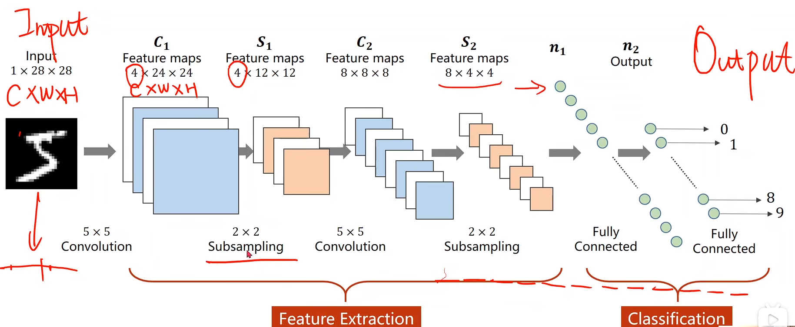
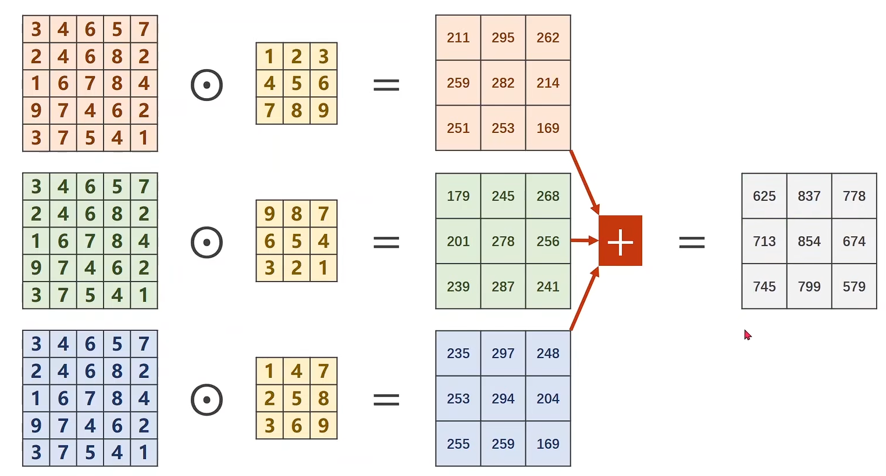
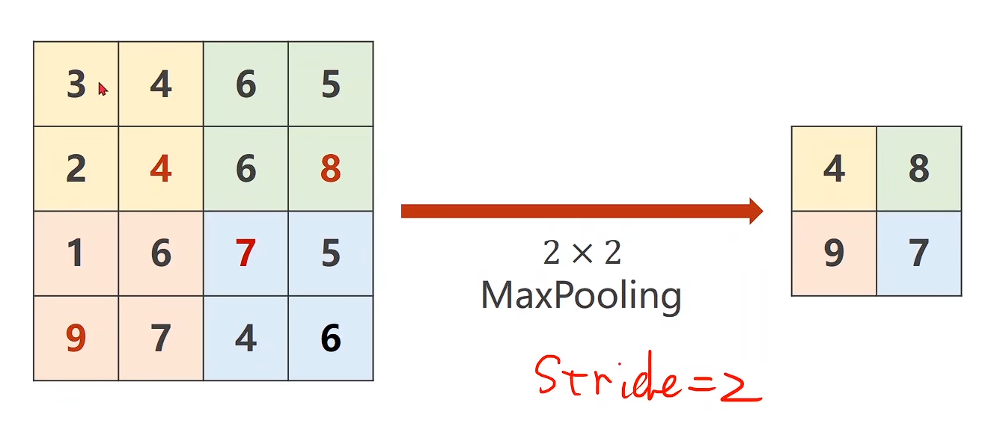
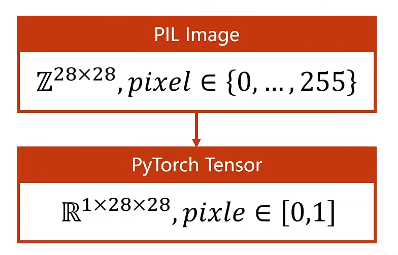
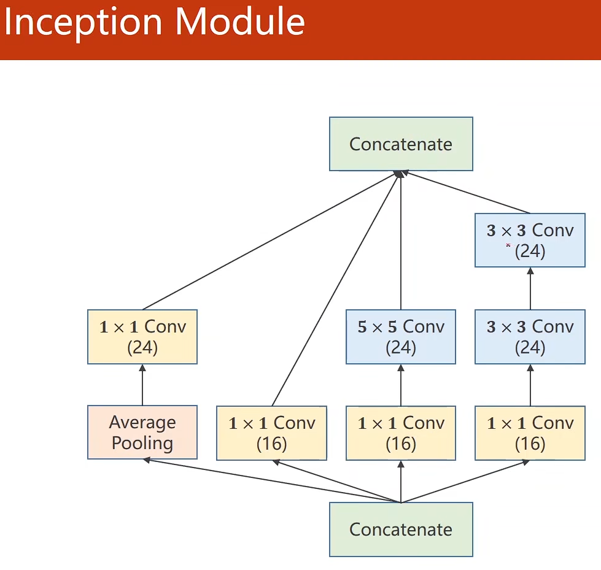
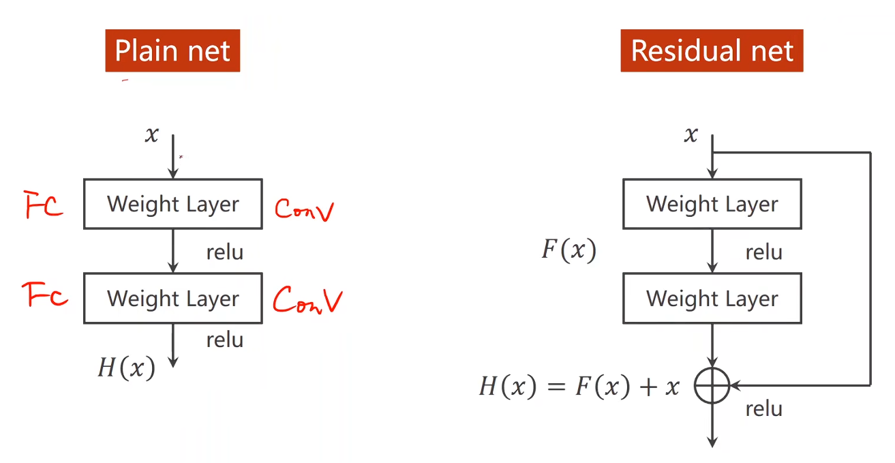

>压力太大的时候，不妨吹吹晚风。
### 卷积神经网络

***

#### 卷积基础篇

一个基本的卷积神经网络图：**输入层->n*(卷积->池化)->全连接层->输出层**




##### 卷积层
卷积过程：用一个卷积核在rgb/灰度图像上遍历，将对应数字相乘再相加，**卷积核的channel数，由单个样本的channel数决定**，最终输出的是单层，**若想要n层通道，则需要n个这样的卷积核**



*测试代码*

```py
import torch
import  torch.nn  as nn


in_channel,out_channer=5,10
width,height=100,100
kernel_size=3
batch_size=1
input = torch.randn(batch_size,in_channel,width,height)
layer=nn.Conv2d(in_channel,out_channer,kernel_size=kernel_size)
output=layer(input)
print(input.shape)
print(output.shape)
print(layer.weight.shape)
```


可以得出，一个nxn输入经过卷积核后，宽高变成**n+1-kernel_size**，若想不改变形状，可以通过给输入增加padding层

*测试代码*

```py
import  torch.nn as nn
import  torch
# 多加一个padding，实现经过卷积核不改变形状


in_channel,out_channer=1,1
width,height=5,5
kernel_size=3
batch_size=1
input = torch.randn(batch_size,in_channel,width,height)
# 在原本的基础上加上padding=1和设置偏置量为0
layer=nn.Conv2d(in_channel,out_channer,kernel_size=kernel_size,padding=1,bias=False)
# 除了可以设置padding之外，还可以设置步长stride，控制卷积核遍历时一次移动的距离
# layer=nn.Conv2d(in_channel,out_channer,kernel_size=kernel_size,stride=2,bias=False)
kernel=torch.tensor([1,2,3,4,5,6,7,8,9],dtype=torch.float32).view(1,1,3,3)
layer.weight.data=kernel
output=layer(input)
print(output)
print(output.shape)
```


##### 池化层
 **池化层**：常用最大池化和均值池化，同样可设置步长和padding，默认步长与kernel_size相同



##### 基础卷积代码实现minist分类

```py
import torch
from torch.utils.data import DataLoader
from torchvision import datasets, transforms

import torch.nn as nn
import torch.nn.functional as F


# 数据预处理
transform = transforms.Compose([transforms.ToTensor(), transforms.Normalize((0.5,), (0.5,))])

# 加载数据集
train_dataset = datasets.MNIST(root='./data', train=True, download=True, transform=transform)
train_loader = DataLoader(train_dataset, batch_size=64, shuffle=True)

test_dataset = datasets.MNIST(root='./data', train=False, download=True, transform=transform)
test_loader = DataLoader(test_dataset, batch_size=64, shuffle=False)


class Net(nn.Module):
    def __init__(self):
        super(Net, self).__init__()
        # 一级卷积层将channel扩大到10
        self.conv1 = nn.Conv2d(1, 10, kernel_size=5)
        # 二级进一步扩大
        self.conv2 = nn.Conv2d(10, 20, kernel_size=5)
        # 定义池化层
        self.pool = nn.MaxPool2d(2)
        # 全连接层将320压缩为10个输出
        self.fc = nn.Linear(320, 10)

    def forward(self, x):
        batch_size = x.size(0)
        # 第一次卷积池化
        x = F.relu(self.pool(self.conv1(x)))
        # 第二次卷积池化
        x = F.relu(self.pool(self.conv2(x)))
        # 展平并进入全连接层
        x = x.view(batch_size, -1)
        x = self.fc(x)
        return x


# pytorch中调用gpu的方法
model = Net()
device = torch.device('cuda:0' if torch.cuda.is_available() else 'cpu')
model.to(device)
# 定义损失函数和优化器
criterion = torch.nn.CrossEntropyLoss()
optimizer = torch.optim.SGD(model.parameters(), lr=0.001, momentum=0.9)

# 训练函数
def train(epoch):
    model.train()  # 设置模型为训练模式
    running_loss = 0.0
    for batch_idx, data in enumerate(train_loader, 0):
        inputs, target = data
        inputs, target = inputs.to(device), target.to(device)
        optimizer.zero_grad()
        # 前向传播获得输出，计算损失值
        outputs = model(inputs)
        loss = criterion(outputs, target)
        # 反向传播计算梯度
        loss.backward()
        # 更新梯度
        optimizer.step()

        running_loss += loss.item()
        if batch_idx % 300 == 299:  # 每300个批次输出一次损失
            print(f'[{epoch + 1}, {batch_idx + 1}] loss: {running_loss / 300:.3f}')
            running_loss = 0.0

# 测试函数
def test():
    model.eval()  # 设置模型为评估模式
    correct = 0
    total = 0
    with torch.no_grad():  # 不计算梯度
        for data in test_loader:
            inputs, target = data
            inputs, target = inputs.to(device), target.to(device)
            outputs = model(inputs)
            _, predicted = torch.max(outputs.data, 1)
            total += target.size(0)
            correct += (predicted == target).sum().item()
    print(f'Accuracy on test set: {100 * correct / total:.2f}% [{correct}/{total}]')

if __name__ == '__main__':
    for epoch in range(10):  # 训练10个epoch
        train(epoch)
        if(epoch%10==9):
            test()

```

上述预处理中用到的transforms.ToTensor()作用：将图像像素归一化，同时变成带有channel数的张量

**PIL是py自带的处理图像工具**




#### 卷积高级篇

***

之前写的是最基础的卷积网络，都是卷积层和池化层串行的。
下面介绍更高级的卷积网络，以下是googleNet的实现

##### GoogleNet

###### Inception

首先需要封装一个多次使用的模块inception
inception解决的问题是给出多条卷积核组合路径，最终训练效果最好的路径权重肯定会最高，从而找到最适卷积层组合



##### googleNet实现minist

```py

import torch
from torch.utils.data import DataLoader
from torchvision import datasets, transforms

import torch.nn as nn
import torch.nn.functional as F


# 数据预处理
transform = transforms.Compose([transforms.ToTensor(), transforms.Normalize((0.5,), (0.5,))])

# 加载数据集
train_dataset = datasets.MNIST(root='./data', train=True, download=True, transform=transform)
train_loader = DataLoader(train_dataset, batch_size=64, shuffle=True)

test_dataset = datasets.MNIST(root='./data', train=False, download=True, transform=transform)
test_loader = DataLoader(test_dataset, batch_size=64, shuffle=False)


class Inception(nn.Module):
    def __init__(self,in_channels):
        super(Inception,self).__init__()
        #初始化层
        self.branch_pool=nn.Conv2d(in_channels,24,kernel_size=1)

        self.branch1x1=nn.Conv2d(in_channels,16,kernel_size=1)

        self.branch5x5_1=nn.Conv2d(in_channels,16,kernel_size=1)
        self.branch5x5_2=nn.Conv2d(16,24,kernel_size=5,padding=2)

        self.branch3x3_1=nn.Conv2d(in_channels,16,kernel_size=1)
        self.branch3x3_2=nn.Conv2d(16,24,kernel_size=3,padding=1)
        self.branch3x3_3=nn.Conv2d(24,24,kernel_size=3,padding=1)

    def forward(self,x):
        #分支从左到右，依次实现
        # stride若不设置，则默认与池化盒大小相等，会造成宽高不一致
        branch_pool=F.avg_pool2d(x,kernel_size=3,padding=1,stride=1)
        branch_pool=self.branch_pool(branch_pool)

        branch_1x1=self.branch1x1(x)

        branch_5x5=self.branch5x5_1(x)
        branch_5x5=self.branch5x5_2(branch_5x5)

        branch_3x3=self.branch3x3_1(x)
        branch_3x3=self.branch3x3_2(branch_3x3)
        branch_3x3=self.branch3x3_3(branch_3x3)

        outputs=[branch_pool,branch_1x1,branch_5x5,branch_3x3]
        return torch.cat(outputs,dim=1)
class Net(nn.Module):
    def __init__(self):
        super(Net,self).__init__()
        self.conv1 = nn.Conv2d(1, 10, kernel_size=5)
        # 88=24+16+24+24
        self.conv2 = nn.Conv2d(88, 20, kernel_size=5)
        #两个inception
        self.incep1=Inception(10)
        self.incep2=Inception(20)
        # 定义池化层
        self.pool = nn.MaxPool2d(2)
        # minist数据集28x28,卷积一次-4=24，池化12，再卷积一次-4=8，池化4，所以最终得到的是88x4x4,展平为1408
        self.fc = nn.Linear(1408, 10)
    def forward(self,x):
        in_size=x.size(0)
        x=F.relu(self.pool(self.conv1(x)))
        x=self.incep1(x)
        x=F.relu(self.pool(self.conv2(x)))
        x=self.incep2(x)
        x=x.view(in_size,-1)
        return self.fc(x)

# pytorch中调用gpu的方法
model = Net()
device = torch.device('cuda:0' if torch.cuda.is_available() else 'cpu')
model.to(device)
# 定义损失函数和优化器
criterion = torch.nn.CrossEntropyLoss()
optimizer = torch.optim.SGD(model.parameters(), lr=0.001, momentum=0.9)

# 训练函数
def train(epoch):
    model.train()  # 设置模型为训练模式
    running_loss = 0.0
    for batch_idx, data in enumerate(train_loader, 0):
        inputs, target = data
        inputs, target = inputs.to(device), target.to(device)
        optimizer.zero_grad()
        # 前向传播获得输出，计算损失值
        outputs = model(inputs)
        loss = criterion(outputs, target)
        # 反向传播计算梯度
        loss.backward()
        # 更新梯度
        optimizer.step()

        running_loss += loss.item()
        if batch_idx % 300 == 299:  # 每300个批次输出一次损失
            print(f'[{epoch + 1}, {batch_idx + 1}] loss: {running_loss / 300:.3f}')
            running_loss = 0.0

# 测试函数
def test():
    model.eval()  # 设置模型为评估模式
    correct = 0
    total = 0
    with torch.no_grad():  # 不计算梯度
        for data in test_loader:
            inputs, target = data
            inputs, target = inputs.to(device), target.to(device)
            outputs = model(inputs)
            _, predicted = torch.max(outputs.data, 1)
            total += target.size(0)
            correct += (predicted == target).sum().item()
    print(f'Accuracy on test set: {100 * correct / total:.2f}% [{correct}/{total}]')

if __name__ == '__main__':
    for epoch in range(10):  # 训练10个epoch
        train(epoch)
        if(epoch%10==9):
            test()

```

##### Residual

- 加入残差块
- 在激活之前，先加上卷积之后的输出，这样求导之后会在1的基础上加上原来的导数，这样即使求导都是<1的数经过累乘也不会很小，从而避免了梯度消失
- 能让前面的层有更好的训练



##### Residual实现minist

```py


import torch
from torch.utils.data import DataLoader
from torchvision import datasets, transforms

import torch.nn as nn
import torch.nn.functional as F


# 数据预处理
transform = transforms.Compose([transforms.ToTensor(), transforms.Normalize((0.5,), (0.5,))])

# 加载数据集
train_dataset = datasets.MNIST(root='./data', train=True, download=True, transform=transform)
train_loader = DataLoader(train_dataset, batch_size=64, shuffle=True)

test_dataset = datasets.MNIST(root='./data', train=False, download=True, transform=transform)
test_loader = DataLoader(test_dataset, batch_size=64, shuffle=False)


# 定义残差块
class Residual(nn.Module):
    def __init__(self,in_channels):
        super(Residual,self).__init__()
        #要保证能相加，就要保证x经过残差块后，channel的值和宽高都不会发生改变
        self.conv1=nn.Conv2d(in_channels,in_channels,kernel_size=3,padding=1)
        self.conv2=nn.Conv2d(in_channels,in_channels,kernel_size=3,padding=1)
    def forward(self,x):
        y=F.relu(self.conv1(x))
        y=self.conv2(y)
        return F.relu(x+y)


class Net(nn.Module):
    def __init__(self):
        super(Net,self).__init__()
        self.conv1 = nn.Conv2d(1, 16, kernel_size=5)
        # 88=24+16+24+24
        self.conv2 = nn.Conv2d(16, 32, kernel_size=5)
        #两个inception
        self.res1=Residual(16)
        self.res2=Residual(32)
        # 定义池化层
        self.pool = nn.MaxPool2d(2)
        # minist数据集28x28,卷积一次-4=24，池化12，再卷积一次-4=8，池化4，残差块不会改变形状不用考虑，所以最终得到的是32x4x4,展平为512
        self.fc = nn.Linear(512, 10)
    def forward(self,x):
        in_size=x.size(0)
        x=F.relu(self.pool(self.conv1(x)))
        x=self.res1(x)
        x=F.relu(self.pool(self.conv2(x)))
        x=self.res2(x)
        x=x.view(in_size,-1)
        return self.fc(x)

# pytorch中调用gpu的方法
model = Net()
device = torch.device('cuda:0' if torch.cuda.is_available() else 'cpu')
model.to(device)
# 定义损失函数和优化器
criterion = torch.nn.CrossEntropyLoss()
optimizer = torch.optim.SGD(model.parameters(), lr=0.001, momentum=0.9)

# 训练函数
def train(epoch):
    model.train()  # 设置模型为训练模式
    running_loss = 0.0
    for batch_idx, data in enumerate(train_loader, 0):
        inputs, target = data
        inputs, target = inputs.to(device), target.to(device)
        optimizer.zero_grad()
        # 前向传播获得输出，计算损失值
        outputs = model(inputs)
        loss = criterion(outputs, target)
        # 反向传播计算梯度
        loss.backward()
        # 更新梯度
        optimizer.step()

        running_loss += loss.item()
        if batch_idx % 300 == 299:  # 每300个批次输出一次损失
            print(f'[{epoch + 1}, {batch_idx + 1}] loss: {running_loss / 300:.3f}')
            running_loss = 0.0

# 测试函数
def test():
    model.eval()  # 设置模型为评估模式
    correct = 0
    total = 0
    with torch.no_grad():  # 不计算梯度
        for data in test_loader:
            inputs, target = data
            inputs, target = inputs.to(device), target.to(device)
            outputs = model(inputs)
            _, predicted = torch.max(outputs.data, 1)
            total += target.size(0)
            correct += (predicted == target).sum().item()
    print(f'Accuracy on test set: {100 * correct / total:.2f}% [{correct}/{total}]')

if __name__ == '__main__':
    for epoch in range(10):  # 训练10个epoch
        train(epoch)
        if(epoch%10==9):
            test()

```